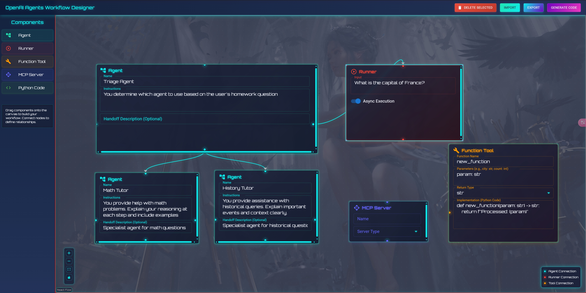
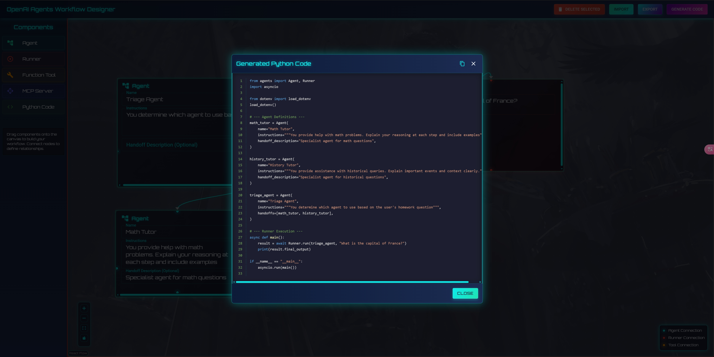
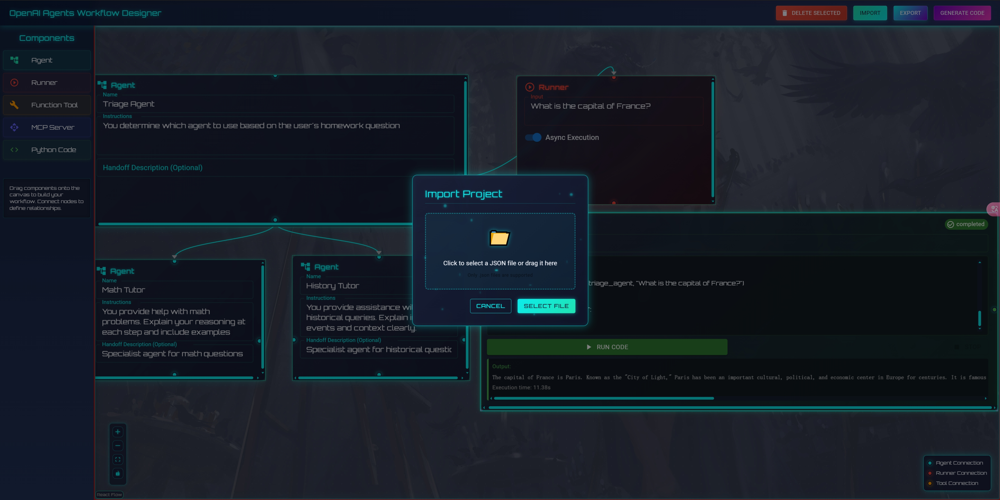
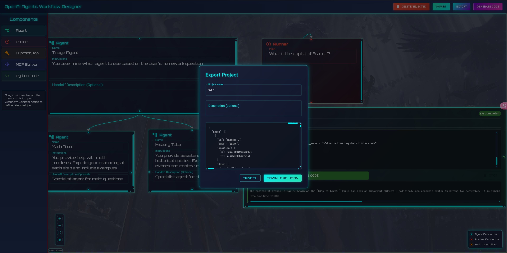

# OpenAI Agents Workflow Designer

A visual drag-and-drop interface for designing and orchestrating OpenAI agent workflows. This tool allows you to visually create complex AI agent systems by connecting different components and automatically generates the corresponding Python code.

Thanks to AI master [AI超元域](https://www.youtube.com/watch?v=KQULGx6wjco) and [Cole Medin](https://www.youtube.com/watch?v=SS5DYx6mPw8). BG Image from [wallpaperswide](https://wallpaperswide.com/)






## Features

- **Visual Workflow Design**: Drag and drop components to build your agent workflow
- **Component Library**: Choose from various pre-built components:
  - Agent nodes (LLM-powered assistants)
  - Runner nodes (execution environments)
  - Function Tool nodes (custom Python functions)
  - Python Code nodes (directly execute Python code)
- **Connection System**: Visually connect components to define relationships and data flow
- **Node Customization**: Resize and configure nodes with intuitive controls
- **Node Management**: Delete nodes and connections via keyboard shortcuts, context menu or navbar button
- **Code Generation**: Automatically generate Python code from your visual workflow
- **Project Management**: Import and export workflows to save and share your designs
- **Python Code Execution**: Execute Python code directly within the application
- **React Flow Integration**: Built on top of React Flow for smooth, interactive node-based interfaces

## Recent Enhancements

- **Python Code Execution Environment**: Execute Python code directly from the UI
  - FastAPI backend with sandboxed execution
  - Real-time execution status and results
  - Secure code validation and execution
  - Support for both synchronous and asynchronous execution
- **Improved Connection Points**: Enhanced node connection points with clearer visual indicators and color-coding
- **Better Scrollbars and Dropdowns**: Redesigned with sci-fi theme styling for improved usability
- **Optimized Delete Functionality**: Delete button moved to the navbar for easier access
- **Connection Type Indicators**: Visual indicators showing different types of connections (Agent, Runner, Tool, Python)

## Installation

### Prerequisites

- Node.js (v16 or later)
- npm or yarn
- Python 3.9+ (for Python code execution)

### Setup

1. Clone the repository:
   ```bash
   git clone https://github.com/GongRzhe/OpenAI-Agents-Workflow-Designer.git
   cd OpenAI-Agents-Workflow-Designer
   ```

2. Install frontend dependencies:
   ```bash
   npm install
   # or
   yarn install
   ```

3. Set up the Python backend (optional, for code execution):
   ```bash
   cd SandBox
   python -m venv .venv
   # On Windows
   .venv\Scripts\activate
   # On macOS/Linux
   source .venv/bin/activate
   pip install -r requirements.txt
   cp .env.example .env
   # Edit .env with your configuration
   ```

4. Start the development server:
   ```bash
   # Start the Python backend (in SandBox directory)
   python run.py
   
   # In a separate terminal, start the frontend
   npm run dev
   # or
   yarn dev
   ```

5. Open your browser and navigate to `http://localhost:5173` (or the port shown in your terminal)

## Usage

### Building a Workflow

1. **Add Components**: Drag components from the left sidebar onto the canvas
2. **Configure Nodes**: Click on nodes to edit their properties in the node panel
3. **Resize Nodes**: Select a node and use the resize handles to adjust its size
4. **Create Connections**: Connect nodes by dragging from one node's handle to another
5. **Delete Components**: Select nodes or edges and press Delete key, use the context menu, or click the Delete Selected button in the navbar
6. **Generate Code**: Click the "Generate Code" button in the top bar to create Python code for your workflow
7. **Execute Python Code**: Use Python Code nodes to write and execute Python code directly
8. **Save/Load**: Use the Import/Export buttons to save and load your workflows

### Component Types

#### Agent Node
Represents an OpenAI-powered agent with specific instructions and capabilities.
- Configure name, instructions, and handoff descriptions
- Connect to Runner nodes and Function Tool nodes
- Customize appearance and size

#### Runner Node
Execution environment that orchestrates the agent interactions.
- Configure input parameters and execution settings (sync/async)
- Acts as a flow controller for agent execution
- Connect multiple agents in a workflow

#### Function Tool Node
Custom Python functions that can be used by agents.
- Define function parameters, return types, and implementation in Python
- Provide extended capabilities to agents
- Access and manipulate data within the workflow

#### Python Code Node
Directly write and execute Python code within the application.
- Real-time execution with status feedback
- Secure sandboxed execution environment
- Output display with execution results and error messages
- Supports both synchronous and asynchronous execution

### Keyboard Shortcuts

- **Delete/Backspace**: Delete selected nodes or edges
- **Escape**: Deselect all elements
- **Mouse Controls**:
  - Click and drag to move nodes
  - Click node handles and drag to create connections
  - Right-click on nodes or edges for context menu

## Project Structure

```
OpenAI-Agents-Workflow-Designer/
├── public/             # Static assets
├── SandBox/            # Python execution environment
│   ├── .venv/          # Python virtual environment
│   ├── api.py          # FastAPI backend for code execution
│   ├── executor.py     # Python code execution engine
│   ├── requirements.txt # Python dependencies
│   └── run.py          # Entry point for the Python backend
├── src/
│   ├── assets/         # Images, fonts, etc.
│   ├── components/     # React components
│   │   ├── common/     # Shared UI components
│   │   ├── layout/     # Layout components (Navbar, Sidebar)
│   │   └── nodes/      # Custom node implementations
│   │       ├── AgentNode.tsx           # Agent node component
│   │       ├── FunctionToolNode.tsx    # Function Tool node component
│   │       ├── PythonCodeNode.tsx      # Python Code node component
│   │       └── RunnerNode.tsx          # Runner node component
│   ├── context/        # React context providers
│   │   ├── NodeDataContext.tsx         # State management for nodes
│   │   └── PythonExecutionContext.tsx  # Python execution state management
│   ├── styles/         # CSS styling including SciFiTheme.css
│   ├── utils/          # Utility functions
│   │   ├── codeGenerator.ts            # Python code generation logic
│   │   ├── projectIO.ts                # Import/export functionality
│   │   └── pythonBridge.ts             # API client for Python execution
│   ├── App.tsx         # Main application component
│   └── main.tsx        # Application entry point
├── index.html          # HTML entry point
├── tsconfig.json       # TypeScript configuration
├── vite.config.ts      # Vite configuration
└── README.md           # Project documentation
```

## Development

### Built With

- React with TypeScript
- [React Flow](https://reactflow.dev/) - For the node-based UI
- [Material-UI](https://mui.com/) - UI component library
- Vite - Build tool and development server
- FastAPI - Python backend for code execution
- Python 3.9+ - For code execution environment

### Adding New Node Types

1. Create a new component in `src/components/nodes/`
2. Register the node type in the `nodeTypes` object in `App.tsx`
3. Add the node to the sidebar in `Sidebar.tsx`
4. Update the code generator in `utils/codeGenerator.ts` to handle the new node type

### Python Code Execution

The Python Code Execution system enables direct Python code execution within the application:

1. **Frontend Components**:
   - PythonCodeNode.tsx - UI component with code editor and execution controls
   - PythonExecutionContext.tsx - React context for state management
   - pythonBridge.ts - API client for communicating with the backend

2. **Backend Components**:
   - api.py - FastAPI server with endpoints for code execution
   - executor.py - Secure code execution engine with sandboxing
   - run.py - Server startup script

3. **Security Features**:
   - Code validation and sanitization
   - Process isolation with multiprocessing
   - Resource limits (CPU time, memory)
   - Execution timeouts
   - Blocked unsafe imports

4. **Execution Modes**:
   - Synchronous execution for quick, simple code
   - Asynchronous execution with status polling for complex code

## Troubleshooting

### Common Issues

- **Python Bridge Connection**: If the Python Code nodes show "Python bridge unavailable", ensure the FastAPI backend is running at http://localhost:8888
- **Layout Problems**: If the canvas area appears too narrow, check the CSS in App.css and index.css to ensure the application takes full width
- **Drag and Drop Issues**: Ensure the onDragStart event is properly setting the node type data
- **Text Selection**: Use the nodrag class for interactive elements within nodes to prevent unwanted dragging
- **Connection Issues**: Check that handle IDs are correctly configured in node components
- **Python Execution Errors**: Check the SandBox/.env file for correct configuration

### Browser Compatibility

This application works best in modern browsers (Chrome, Firefox, Edge, Safari). Internet Explorer is not supported.

## Planned Features

- Copy/paste functionality for nodes
- Undo/redo system
- Workflow validation
- Template workflows
- OpenAI API integration for live testing
- Enhanced Python code execution with dependency management

## License

[MIT](LICENSE)

## Contributing

Contributions are welcome! Please feel free to submit a Pull Request.

1. Fork the repository
2. Create your feature branch (`git checkout -b feature/amazing-feature`)
3. Commit your changes (`git commit -m 'Add some amazing feature'`)
4. Push to the branch (`git push origin feature/amazing-feature`)
5. Open a Pull Request

## Acknowledgments

- [OpenAI](https://openai.com/) for their powerful API and agent capabilities
- [React Flow](https://reactflow.dev/) for the excellent node-based interface library
- [Material-UI](https://mui.com/) for the comprehensive UI component library
- [FastAPI](https://fastapi.tiangolo.com/) for the high-performance Python web framework